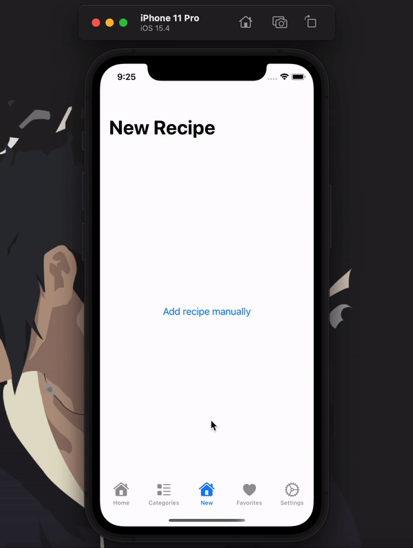
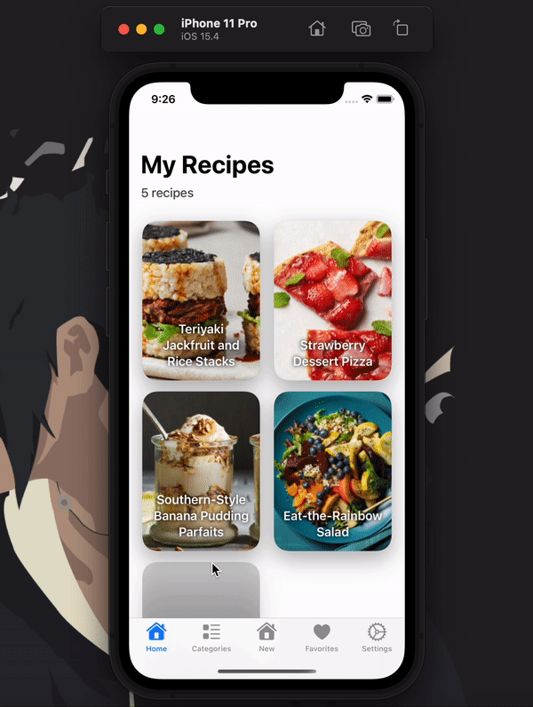

# Recipe app in swift

## You can view recipes and each detailed window for it

---

## You can create your own recipes

---

## And of course they are nicely sorted into categories specified when creating one 😄

